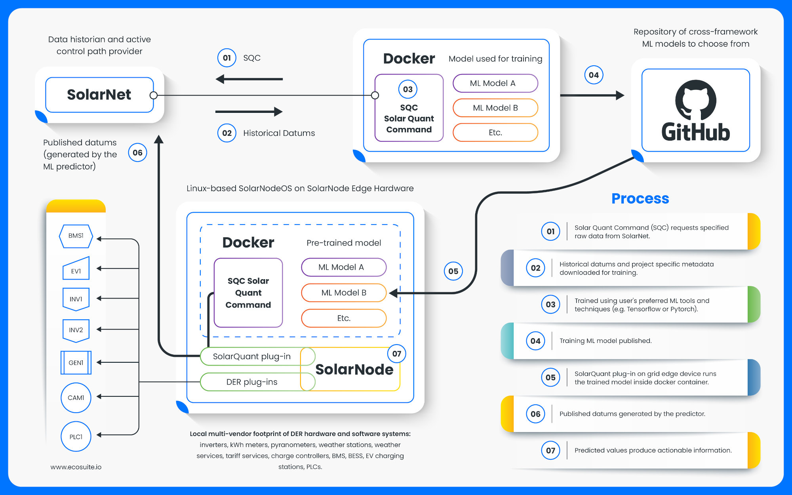

## SolarQuant

This repository contains the SolarQuant environment tooling, which allows
the user to easily source training data to be used for training machine
learning predictors. SolarQuant works by consuming OrangeButton and
SolarNetwork (http://solarnetwork.net) data, both of which are free and open source.

High level process flow:


<u>Note</u>: Steps 1 and 2 in the above process flow are demonstrated in this [SQC video](https://www.youtube.com/watch?v=bvcLa1SFhjA)
and examples of the resulting inference algorithms are begining to be collected [here](https://github.com/ecosuite/solarquant-zoo).

A containerized ready to go version of SolarQuant is maintained here: https://hub.docker.com/r/ecosuite/solarquant

### Documentation

A live pre-built version of the SolarQuant documentation is available here: https://ecosuite.github.io/solarquant

To build the latest documentation from source, compile the Sphinx[1] documentation in the `docs` directory:

```shell
$ cd docs
$ make html
```

[1]: https://www.sphinx-doc.org/en/master/

